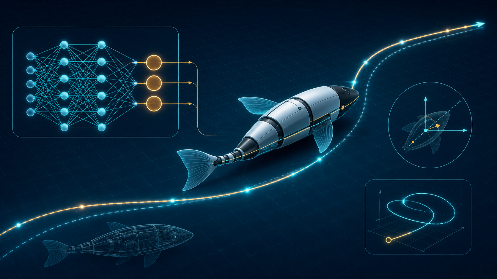

# Differentiable Reinforcement Learning for PID Path Tracking

## Abstract

This work presents a differentiable reinforcement-learning framework for path tracking in a reduced-order model of a bio-inspired swimming robot. Using backpropagation through time, a neural-network controller learns adaptive PID gains for the nonlinear dynamics of a modified Chaplygin sleigh. Combined with pure-pursuit guidance and a prescribed velocity target, the controller enables the robot to accurately follow reference trajectories despite its underactuated dynamics, as demonstrated in simulation.

## Video

<video controls muted loop width="100%" poster="diffrl-thumbnail.png">
  <source src="iros_video_comp%20-%20Trim.mp4" type="video/mp4">
  Your browser does not support embedded video. [Download the demonstration video](iros_video_comp%20-%20Trim.mp4).
</video>

## Method

The controller is trained end to end by differentiating through the reduced-order dynamics over time. A neural network generates the PID gains, while a pure-pursuit lookahead point provides the reference heading and each training episode uses a constant target velocity.
